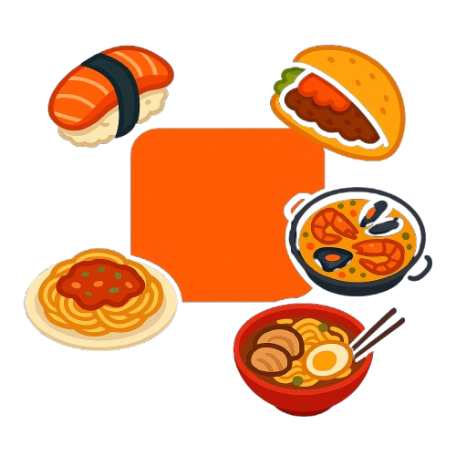

# Tastify

> **The new way to learn about world cuisines — gamified, interactive, and fun!**

---

---

## 🚀 What is Tastify?

Tastify is a next-generation platform that transforms learning about global cuisines into an engaging, competitive, and rewarding experience. Whether you're a food enthusiast, a curious learner, or just love a challenge, Tastify makes discovering culinary cultures fun and addictive.

---

## ✨ Why You'll Love Tastify

- **Gamified Learning:** Earn points, keep your hearts, and build streaks as you progress.
- **Interactive Lessons:** Dive into bite-sized lessons, quizzes, and real-world culinary tips.
- **Daily & Weekly Quests:** Stay motivated with new challenges every day and week.
- **Shop & Rewards:** Redeem your points for cool in-app items and perks.
- **Leaderboard:** Compete with friends and users worldwide for the top spot.
- **Beautiful, Modern UI:** Enjoy a visually stunning and intuitive interface.
- **Mobile Ready:** Learn and play anywhere, anytime.

---

## 🖼️ App Highlights

### Home / Welcome

### Explore Courses

### Learn & Progress

### Lesson Context

### Quests & Missions

### Shop & Rewards

### Leaderboard

### User Progress Sidebar

---

## 🌍 Main Sections

- **Courses:** Choose from a variety of world cuisines and start your journey.
- **Learn:** Progress through interactive units and lessons, unlock new content, and test your knowledge.
- **Lesson Context:** Get rich, contextual information, tips, and cultural insights for every lesson.
- **Quests:** Complete daily and weekly missions for extra points and rewards.
- **Shop:** Spend your hard-earned points on exclusive items and features.
- **Leaderboard:** See how you stack up against the community.
- **Profile & Progress:** Track your hearts, points, streaks, and achievements.

---

## 💬 What Users Say

> "Tastify makes learning about food cultures as fun as playing a game!"

> "I love the quests and the feeling of progress every day."

> "The design is beautiful and the lessons are actually useful!"

---

## 🎯 Who is Tastify for?

- Food lovers and home cooks
- Students and lifelong learners
- Anyone who loves games and challenges
- People curious about world cultures

---

## 🔥 Ready to Taste the World?

**Jump in, start learning, and climb the leaderboard!**

[Try Tastify now!](https://tastify-rosy.vercel.app/)

---

> _Tastify: Learn by playing, progress by competing!_

---

**Follow us on social media:**

- [Instagram](#)
- [Twitter](#)
- [Facebook](#)

---

_Screenshots are for demonstration purposes. Update the images in the `public/` folder to showcase your own app experience!_
